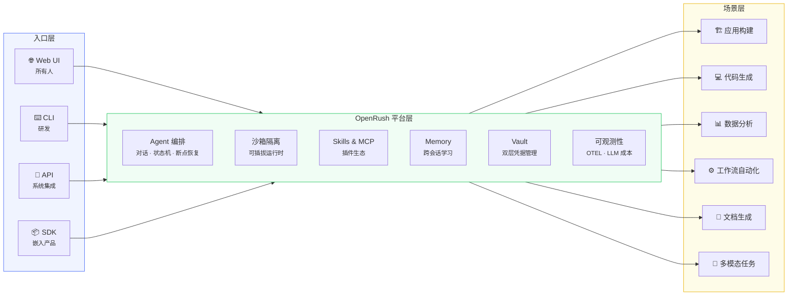
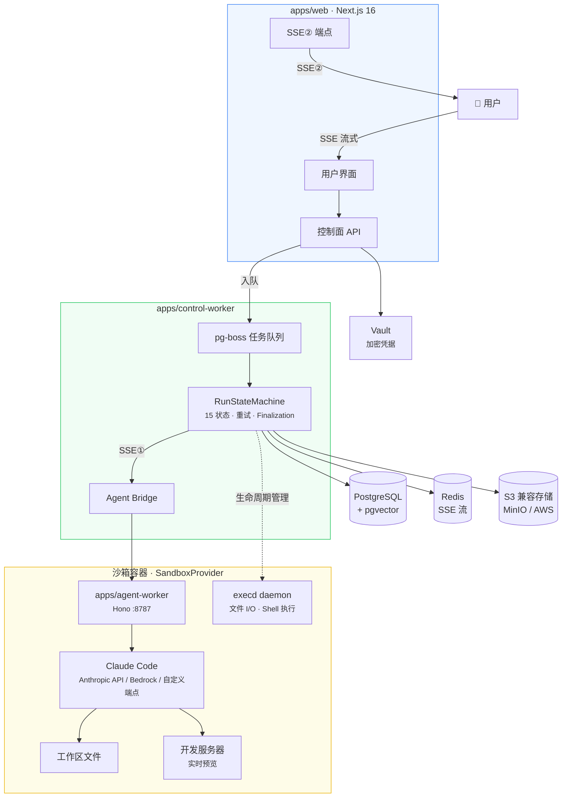
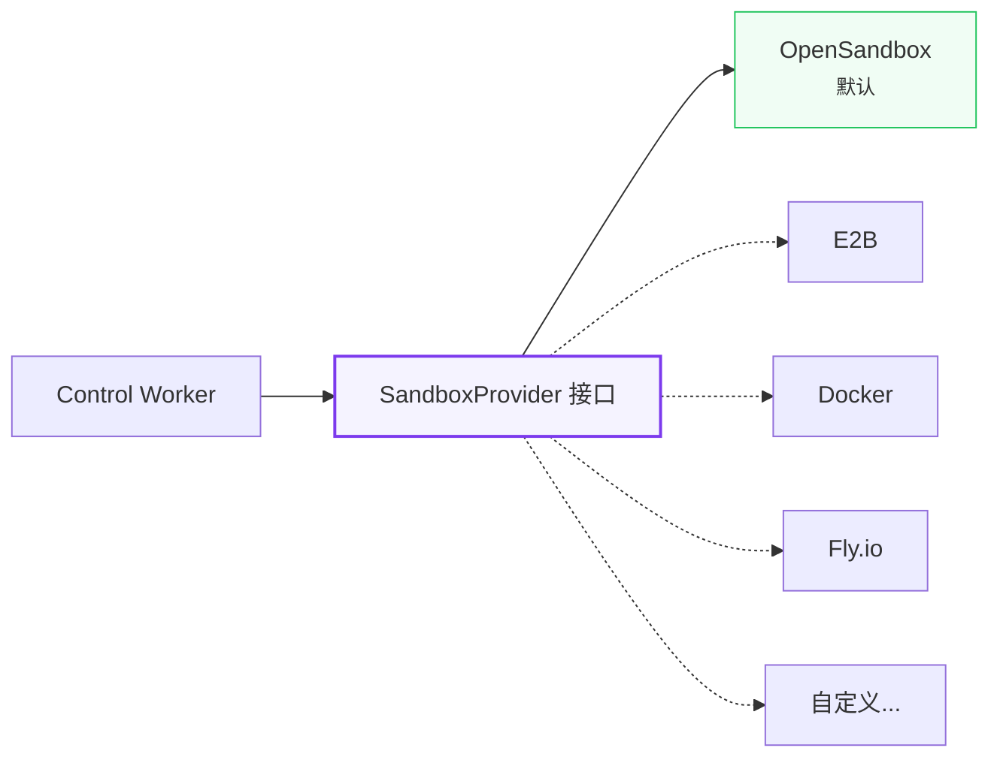
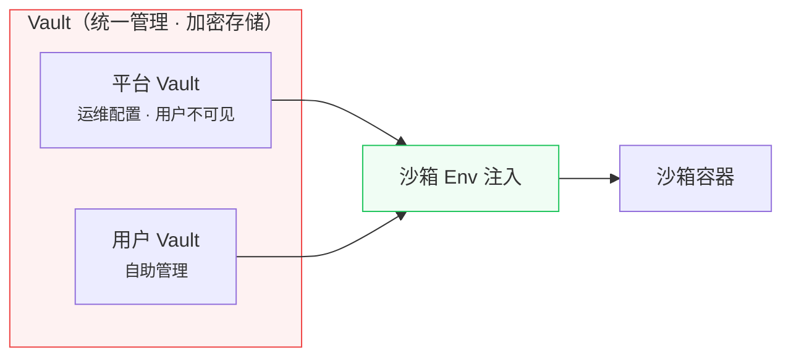

# OpenRush

**自托管 AI Agent 基础设施 —— 多场景、可插拔、开箱即用。**

## 背景

团队成员此前参与过 AI Agent 平台与可观测性系统的建设，覆盖从 MVP 到规模化运行的完整周期。OpenRush 是我们基于这些实践经验，**独立设计和实现的开源项目**。

## 为什么做 OpenRush

每个企业都在思考如何让 AI Agent 真正投入工作。当前的选择：锁定某个厂商的云服务、拼凑脆弱的工具链、或者从零构建。

OpenRush 走一条不同的路。**在你自己的基础设施上部署一次，然后让所有人——研发和非研发——都能用 AI Agent 完成日常工作。** 研发通过 CLI 和 API 自动化。产品团队通过对话构建应用。数据团队用自然语言做分析。所有任务运行在沙箱化的 Claude Code Agent 中，凭据加密管理、权限严格控制、数据不离开你的网络。

我们相信企业软件的未来不是"在现有工具上嵌入 AI 功能"——而是 **AI Agent 成为主要交互界面**，底层有正确的基础设施支撑：沙箱隔离执行、凭据安全管理、插件化能力扩展、可观测的运维体系。

OpenRush 就是这个基础设施，开源。

## 对标

OpenRush 不是某个单一工具的替代品，而是将多个场景统一在一个自托管平台中：

| 场景         | 对标产品                                                                                                        | OpenRush 的差异                             |
| ------------ | --------------------------------------------------------------------------------------------------------------- | ------------------------------------------- |
| AI 建站      | [bolt.new](https://bolt.new), [Lovable](https://lovable.dev), [v0](https://v0.dev)                              | 自托管、不只是建站、企业级权限和凭据管理    |
| AI 编码      | [Cursor](https://cursor.com), [Windsurf](https://windsurf.com)                                                  | 不是 IDE 插件，是平台级服务，非研发也能用   |
| Agent 运行时 | [Anthropic Managed Agents](https://platform.claude.com/docs/en/managed-agents/overview), [E2B](https://e2b.dev) | 自托管、可插拔沙箱、不锁定云厂商            |
| Agent 编排   | [LangGraph](https://www.langchain.com/langgraph), [CrewAI](https://www.crewai.com)                              | 内置沙箱执行环境，不只是编排框架            |
| 企业 AI 平台 | 各厂商私有方案                                                                                                  | 开源、Claude Code 原生、Skills/MCP 插件生态 |

**一句话：别人做的是某个场景的工具，OpenRush 做的是承载所有场景的企业基础设施。**

## 愿景

> 一次部署，全员可用。多种入口接入，多种场景覆盖，统一平台承载。



**当前 scope（M0–M4）：** 平台层 + 应用构建场景 + Web UI 入口。CLI、API、SDK 及更多场景在 GA 之后推进。

## 架构

三层设计 —— 用户请求经控制面编排，在沙箱容器中由 Claude Code 执行，结果流式返回。



### 沙箱可插拔



`SandboxProvider` 是公开接口。OpenSandbox 是内置默认实现，社区可贡献其他实现。通过环境变量一键切换：`SANDBOX_PROVIDER=opensandbox | e2b | docker`

### 凭据安全



Vault 统一管理所有凭据（加密存储），运行时注入沙箱环境变量。平台 Vault 对用户不可见。

后续增强（可选）：对 HTTP API 类凭据启用 Credential Proxy，密钥不进容器。

## 平台能力

| 能力             | 说明                                             |
| ---------------- | ------------------------------------------------ |
| **Agent 编排**   | 对话、任务分发、15 状态机、断点恢复、流式中间件  |
| **沙箱隔离**     | 每任务独立容器，可插拔运行时，资源限制，网络策略 |
| **Skills & MCP** | 插件市场 + Model Context Protocol 服务器扩展     |
| **Memory**       | 跨会话学习、用户偏好、pgvector 向量搜索          |
| **Vault**        | 双层凭据（平台 + 用户），加密存储，env 注入沙箱  |
| **多租户**       | 用户隔离、项目隔离、RBAC 权限控制                |
| **可观测性**     | OpenTelemetry traces + metrics + LLM 成本追踪    |

## 设计原则

- **自托管优先** —— 你的数据、你的基础设施、你的规则
- **Claude Code 原生** —— 三种连接模式：Anthropic API / AWS Bedrock / 自定义端点
- **安全默认** —— 双层 Vault 加密存储，沙箱 env 注入，可选 Credential Proxy 增强
- **可插拔** —— 沙箱、存储、认证、可观测后端均可替换
- **零供应商锁定** —— 标准 OTEL、NextAuth.js、S3 兼容、Drizzle ORM

## 技术栈

| 层     | 技术                                               |
| ------ | -------------------------------------------------- |
| 前端   | Next.js 16, React 19, Tailwind 4, shadcn/ui        |
| 后端   | Hono (agent), pg-boss (队列), Drizzle ORM          |
| AI     | Claude Code (Anthropic API / Bedrock / 自定义端点) |
| 数据库 | PostgreSQL 16 + pgvector                           |
| 沙箱   | 可插拔 SandboxProvider                             |
| 缓存   | Redis (可恢复 SSE 流)                              |
| 存储   | S3 兼容 (MinIO / AWS)                              |
| 认证   | NextAuth.js v5                                     |
| 可观测 | OpenTelemetry                                      |

## 里程碑

| 里程碑         | 状态    | 重点                                           |
| -------------- | ------- | ---------------------------------------------- |
| M0: 骨架       | ✅ 完成 | 基础设施、沙箱 PoC、安全基线                   |
| M1: Agent 闭环 | ✅ 完成 | 沙箱内 Claude Code 执行、Web API、SSE 流式输出 |
| M2: MVP 核心   | ✅ 完成 | 项目管理、对话历史、Finalization、Recovery     |
| M3: 体验       | 进行中  | Vault 凭据注入、Skills、MCP、Memory            |
| M4: 生产       | 待开始  | E2E 测试、OTEL、K8s 部署、文档                 |

完整计划见 [Roadmap](docs/roadmap.md)。

## 快速开始

```bash
# 前置：Node.js 22+, pnpm, Docker

git clone https://github.com/anthropics/open-rush.git
cd open-rush
pnpm install
pnpm db:up              # PostgreSQL, Redis, MinIO（Docker Compose）
pnpm db:push            # 推送数据库 schema
```

### 配置环境变量

每个 app 目录下有 `.env.example`，复制为 `.env.local` 并填入实际值：

```bash
cp apps/web/.env.example apps/web/.env.local
cp apps/control-worker/.env.example apps/control-worker/.env.local
cp apps/agent-worker/.env.example apps/agent-worker/.env.local
```

`apps/web/.env.local` 需要额外配置 GitHub OAuth：

1. 前往 [GitHub Developer Settings](https://github.com/settings/developers) 创建 OAuth App
   - **Homepage URL**: `http://localhost:3000`
   - **Callback URL**: `http://localhost:3000/api/auth/callback/github`
2. 将 Client ID 和 Client Secret 填入 `AUTH_GITHUB_ID` 和 `AUTH_GITHUB_SECRET`

### 启动

```bash
pnpm build
pnpm dev                # http://localhost:3000
```

## 贡献者

| GitHub                                                                                   | 方向                                                                               |
| ---------------------------------------------------------------------------------------- | ---------------------------------------------------------------------------------- |
| [@pandoralink](https://github.com/pandoralink)                                           | Web 交互体验、AI 对话链路、可观测平台前端                                          |
| [@fwxhn](https://github.com/fwxhn)                                                       | CLI 工具链、[reskill](https://github.com/nicepkg/reskill) 包管理器、可观测平台前端 |
| [@yongchaoo](https://github.com/yongchaoo) · [luocy010@163.com](mailto:luocy010@163.com) | MCP 运行时、Agent 交付模式、前端可观测性                                           |

以上贡献者目前正在看新的机会，欢迎联系。

## 参与贡献

我们在开放中构建。欢迎贡献 —— 详见 [CONTRIBUTING.md](CONTRIBUTING.md)。

如果你对 AI Agent 基础设施感兴趣，或者认同我们的方向，欢迎参与。提 Issue、发 PR、或者只是给个 Star 让更多人看到，都是对我们最大的支持。

## 许可

[MIT](LICENSE)
