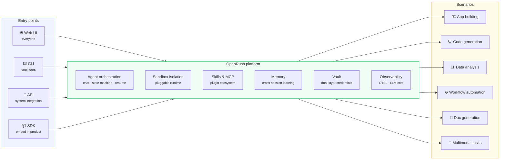
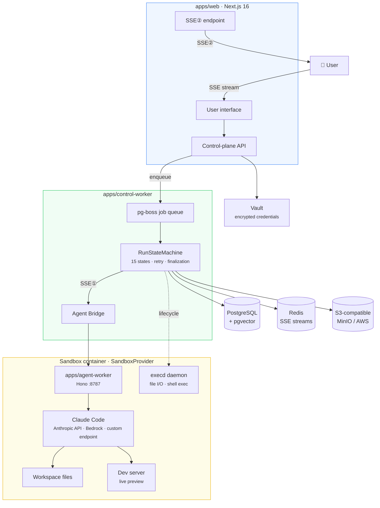
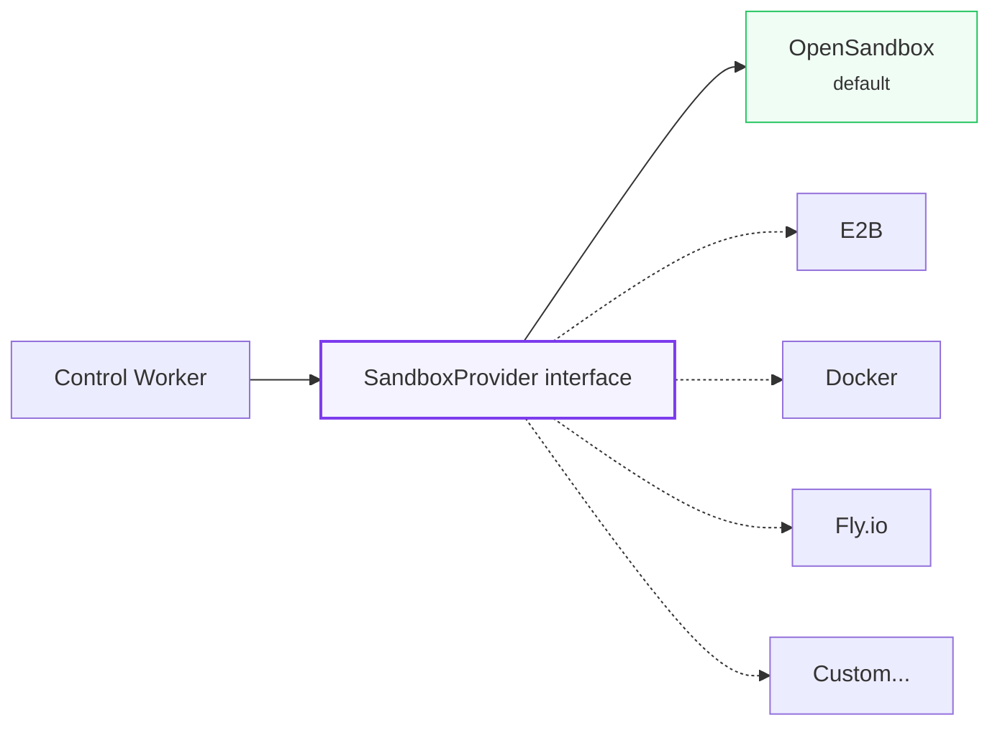
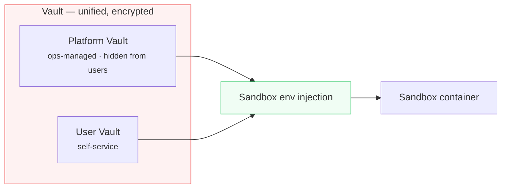

# OpenRush

> **Run managed agents on your own infrastructure. Claude Code native. Registry included.**

<p>
  <a href="./README.md">English</a> · <a href="./README.zh-CN.md">中文</a>
</p>

<p>
  
  
  
  
  
  
</p>

OpenRush is an open-source **managed-agents platform for Claude Code** that you deploy on your own infrastructure. One install gives you a stable `/api/v1/*` contract, sandboxed execution, a Registry for Agents / Skills / MCP servers, dual-layer Vault, and an AI SDK–native UIMessage event stream.

## Why OpenRush

Enterprises are asking how to put AI agents to work without locking into a vendor cloud, stitching together fragile tooling, or rebuilding from scratch. OpenRush takes a different path.

**Deploy once on your own infrastructure, then let everyone — engineers and non-engineers — use Claude Code agents for everyday work.** Engineers drive it through the CLI/API. Product teams build apps through conversation. Data teams run analyses in plain language. Every task runs inside a sandbox, with credentials encrypted, permissions scoped, and data kept inside your network.

We believe the future of enterprise software isn't "AI features stapled onto existing tools" — it's **AI agents as the primary interface**, supported by the right infrastructure: sandbox isolation, credential safety, pluggable capability, observable operations.

OpenRush is that infrastructure, open-sourced.

## Vision

> One install, available to everyone. Multiple entry points, multiple scenarios, one platform underneath.



**Current scope (M0–M4):** the platform layer, the app-building scenario, and the Web UI entry point. CLI, API, SDK and additional scenarios land after GA.

## How OpenRush compares

### vs. Claude Managed Agents

Anthropic's [Claude Managed Agents](https://platform.claude.com/docs/en/managed-agents/overview) (beta, `managed-agents-2026-04-01`) and OpenRush both give you a managed harness for Claude with tools, MCP, and streamed events. The bet each side makes is different.

| Area | Claude Managed Agents | **OpenRush** |
| --- | --- | --- |
| Deployment | Managed infrastructure on `api.anthropic.com` | **Self-hosted** on your own infrastructure |
| Execution environment | `config.type: "cloud"` container provisioned by Anthropic | **Pluggable `SandboxProvider`** — OpenSandbox default, swap to E2B / Docker / Fly |
| Versioning | "Environments are not versioned" (docs, Environment lifecycle) | **Immutable AgentDefinition versions** (`PATCH` ⇒ new version, `If-Match` optimistic concurrency) |
| Data residency | Runs in Anthropic-managed containers | Stays inside your network; you pick storage, DB, observability backends |
| Ecosystem surface | Tools + MCP servers + skills bundled per agent | **Self-hosted Registry** for AgentDefinitions, Skills, and MCP servers, plus **dual-layer Vault** and Web UI on top |

**Shorthand**: Claude Managed Agents is the vendor-hosted option. OpenRush is the self-hosted option with a first-class catalog and governance layer. Anthropic's [branding guidelines](https://platform.claude.com/docs/en/managed-agents/overview#branding-guidelines) apply to any third-party product built on Claude, OpenRush included.

### vs. adjacent categories

OpenRush is not a replacement for any single tool — it unifies several scenarios on a self-hosted platform.

| Scenario | Comparable offerings | How OpenRush differs |
| --- | --- | --- |
| AI site building | [bolt.new](https://bolt.new) · [Lovable](https://lovable.dev) · [v0](https://v0.dev) | Self-hosted, not limited to site building, enterprise-grade permissions + credentials |
| AI coding | [Cursor](https://cursor.com) · [Windsurf](https://windsurf.com) | Not an IDE plugin — a platform service usable by non-engineers |
| Managed-agent runtimes | [Claude Managed Agents](https://platform.claude.com/docs/en/managed-agents/overview) · [E2B](https://e2b.dev) | Self-hosted, pluggable sandbox, Registry included |
| Agent orchestration | [LangGraph](https://www.langchain.com/langgraph) · [CrewAI](https://www.crewai.com) | Built-in sandbox execution — not just an orchestration library |
| Enterprise AI platforms | Vendor-proprietary suites | Open source, Claude Code native, Skills / MCP ecosystem |

**In one line**: others make a tool for one scenario; OpenRush is the infrastructure that carries them all.

## Architecture

A three-tier design — user requests are orchestrated by the control plane, executed by Claude Code inside a sandbox container, and streamed back.



### Pluggable sandbox



`SandboxProvider` is a public interface. OpenSandbox is the built-in default; the community can contribute more. Switch with a single env var: `SANDBOX_PROVIDER=opensandbox | e2b | docker`.

### Credential security



The Vault encrypts every credential and injects them into the sandbox as environment variables at run time. The platform Vault is never visible to end users.

Optional hardening: route HTTP API credentials through a Credential Proxy so the secret never enters the container.

## Platform capabilities

| Capability | What it covers |
| --- | --- |
| **Agent orchestration** | Chat, task dispatch, 15-state machine, resume from checkpoint, streaming middleware |
| **Sandbox isolation** | Per-task container, pluggable runtime, resource limits, network policy |
| **Skills & MCP** | Skills marketplace plus Model Context Protocol server extensions |
| **Memory** | Cross-session learning, user preferences, pgvector similarity search |
| **Vault** | Dual-layer credentials (platform + user), encrypted storage, env injection into sandbox |
| **Multi-tenancy** | User isolation, project isolation, RBAC |
| **Observability** | OpenTelemetry traces + metrics + LLM cost tracking |

## Design principles

- **Self-hosted first** — your data, your infrastructure, your rules.
- **Claude Code native** — three connection modes: Anthropic API, AWS Bedrock, custom endpoint.
- **Secure by default** — dual-layer Vault with encrypted storage, sandbox env injection, optional Credential Proxy.
- **Pluggable** — sandbox, storage, auth, and observability backends are all swappable.
- **No cloud lock-in for the platform** — standard OTEL, NextAuth.js, S3-compatible storage, Drizzle ORM. You still choose your model provider.

## Tech stack

| Layer | Technology |
| --- | --- |
| Frontend | Next.js 16, React 19, Tailwind 4, shadcn/ui |
| Backend | Hono (agent), pg-boss (queue), Drizzle ORM |
| AI | Claude Code (Anthropic API / Bedrock / custom endpoint) |
| Database | PostgreSQL 16 + pgvector |
| Sandbox | Pluggable `SandboxProvider` |
| Cache | Redis (resumable SSE streams) |
| Storage | S3-compatible (MinIO / AWS) |
| Auth | NextAuth.js v5 |
| Observability | OpenTelemetry |

## Project status

| Milestone | Status | Focus |
| --- | --- | --- |
| M0: Skeleton | ✅ Done | Infra, sandbox PoC, security baseline |
| M1: Agent loop | ✅ Done | In-sandbox Claude Code execution, Web API, SSE streaming |
| M2: MVP core | ✅ Done | Project management, conversation history, finalization, recovery |
| M3: Experience | ✅ Done | Vault injection, Skills, MCP, Memory |
| M4: Managed-agents API | 🚧 In progress | Stable `/api/v1/*`, AgentDefinition versioning, service tokens, OpenAPI spec, E2E |

Full plan in [`docs/roadmap.md`](docs/roadmap.md). The M4 task breakdown and live status lives in [`docs/execution/TASKS.md`](docs/execution/TASKS.md).

## Quickstart (3 steps)

> Full walkthrough — curl samples, troubleshooting, SSE reconnect — in [`docs/quickstart.md`](docs/quickstart.md).

### 1. Install and start the platform

```bash
# Prereqs: Node.js 22+, pnpm 10+, Docker
git clone https://github.com/kanyun-rush/open-rush.git
cd open-rush
pnpm install

# Postgres + Redis + MinIO via Docker Compose
pnpm db:up
pnpm db:push

# Configure env (edit each .env.local after copying)
cp apps/web/.env.example           apps/web/.env.local
cp apps/control-worker/.env.example apps/control-worker/.env.local
cp apps/agent-worker/.env.example   apps/agent-worker/.env.local

pnpm dev                # http://localhost:3000
```

Set `ANTHROPIC_API_KEY` (or Bedrock creds), and create a GitHub OAuth App ([Developer Settings](https://github.com/settings/developers)) with callback `http://localhost:3000/api/auth/callback/github` to populate `AUTH_GITHUB_ID` / `AUTH_GITHUB_SECRET`.

### 2. Mint a service token

Sign into the Web UI, go to **Settings → API Tokens → New token**, pick scopes (e.g. `agents:write`, `runs:write`, `runs:read`, `runs:cancel`), and copy the plaintext `sk_...` once. Token creation is session-gated — service tokens cannot mint service tokens.

```bash
export OPENRUSH_BASE=http://localhost:3000
export OPENRUSH_TOKEN=sk_...
export OPENRUSH_PROJECT=<project-uuid>
```

### 3. Create an Agent and stream its run

```bash
# Create an AgentDefinition (blueprint)
DEF=$(curl -s -X POST "$OPENRUSH_BASE/api/v1/agent-definitions" \
  -H "Authorization: Bearer $OPENRUSH_TOKEN" \
  -H 'Content-Type: application/json' \
  -d "{\"projectId\":\"$OPENRUSH_PROJECT\",\"name\":\"echo-bot\",\"providerType\":\"claude-code\",\"model\":\"claude-sonnet-4-5\",\"systemPrompt\":\"You are concise.\",\"allowedTools\":[\"Bash\",\"Read\",\"Write\"],\"skills\":[],\"mcpServers\":[],\"maxSteps\":20,\"deliveryMode\":\"chat\"}" \
  | jq -r '.data.id')

# Create an Agent + first Run
RUN=$(curl -s -X POST "$OPENRUSH_BASE/api/v1/agents" \
  -H "Authorization: Bearer $OPENRUSH_TOKEN" \
  -H 'Content-Type: application/json' \
  -d "{\"projectId\":\"$OPENRUSH_PROJECT\",\"definitionId\":\"$DEF\",\"mode\":\"chat\",\"initialInput\":\"List /tmp and count files.\"}")
AGENT_ID=$(echo "$RUN" | jq -r '.data.agent.id')
RUN_ID=$(echo "$RUN" | jq -r '.data.firstRunId')

# Stream events (AI SDK UIMessageChunk + data-openrush-* extensions)
curl -N "$OPENRUSH_BASE/api/v1/agents/$AGENT_ID/runs/$RUN_ID/events" \
  -H "Authorization: Bearer $OPENRUSH_TOKEN"
```

SSE reconnect uses `Last-Event-ID` (no query cursor). See [`specs/managed-agents-api.md` §Event protocol (SSE)](specs/managed-agents-api.md#event-protocol-sse) for the full protocol.

## API reference

- **[`docs/api.md`](docs/api.md)** — endpoint index, auth, error codes, SSE format.
- **[`specs/managed-agents-api.md`](specs/managed-agents-api.md)** — binding API contract.
- **OpenAPI spec** — machine-readable document, planned at `docs/specs/openapi-v0.1.yaml` (delivered in task-15).
- **`@open-rush/sdk`** — typed TypeScript client with built-in SSE + `Last-Event-ID` reconnect (delivered in task-16).

Until the OpenAPI spec and SDK are merged, the authoritative types live in [`packages/contracts/src/v1/`](packages/contracts/src/v1) and the curl samples above give you a working integration.

## Contributors

| GitHub | Focus |
| --- | --- |
| [@pandoralink](https://github.com/pandoralink) | Web interaction experience, AI chat pipeline, observability frontend |
| [@yanglx-lara](https://github.com/yanglx-lara) | CLI toolchain, [reskill](https://github.com/nicepkg/reskill) package manager, observability frontend |
| [@yongchaoo](https://github.com/yongchaoo) · [luocy010@163.com](mailto:luocy010@163.com) | MCP runtime, agent delivery modes, frontend observability |

The contributors above are currently open to new opportunities — feel free to reach out.

## Contributing

We build in the open. Contributions welcome — see [CONTRIBUTING.md](CONTRIBUTING.md) for the workflow (Spec-first + Sparring Review).

If you care about AI agent infrastructure or share our direction, filing issues, sending PRs, or simply starring the repo all help.

## License

[MIT](LICENSE)
