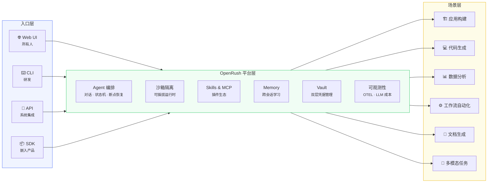
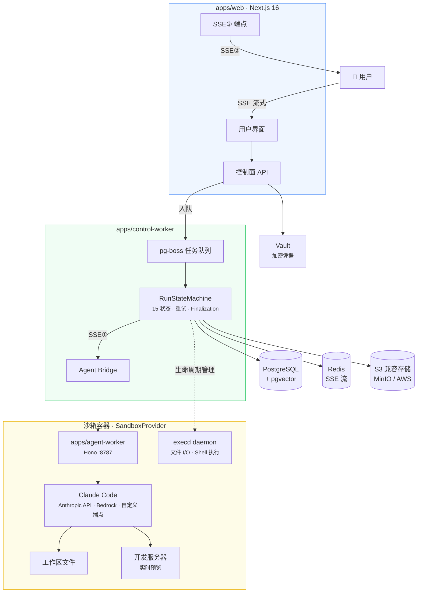
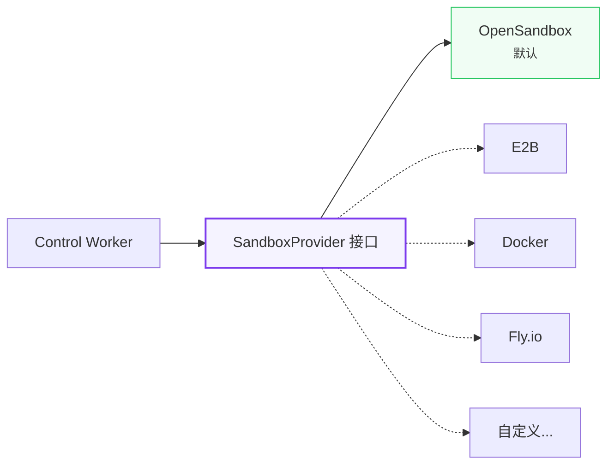
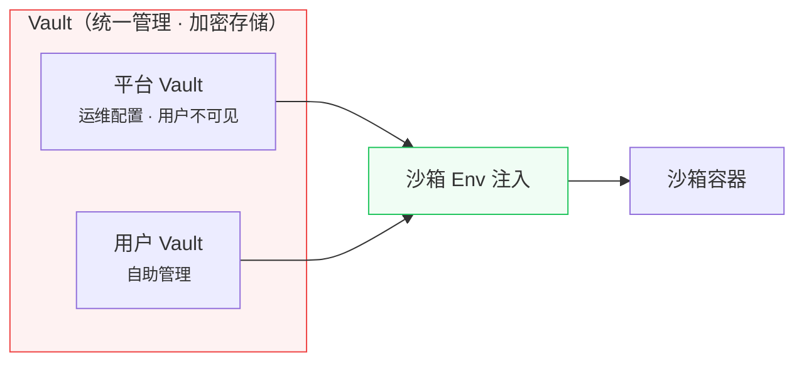

# OpenRush

> **在自有基础设施上运行 Claude Code 托管 Agent，自带 Registry。**

<p>
  <a href="./README.md">English</a> · <a href="./README.zh-CN.md">中文</a>
</p>

<p>
  
  
  
  
  
  
</p>

OpenRush 是一个开源的 **Claude Code 托管 Agent 平台**，部署在你自己的基础设施上。一次安装即可获得稳定的 `/api/v1/*` 契约、沙箱执行、Agent / Skill / MCP 的 Registry、双层 Vault，以及 AI SDK 原生的 UIMessage 事件流。

## 为什么选 OpenRush

企业想让 AI Agent 为业务所用，但既不想锁死在某家厂商的云里，也不想拿脆弱的胶水代码东拼西凑，更不想从零造轮子。OpenRush 走另一条路。

**一次部署到自有基础设施，让所有人 —— 工程师和非工程师 —— 都能把 Claude Code Agent 用在日常工作里。** 工程师通过 CLI / API 调度，产品团队通过对话构建应用，数据团队用自然语言做分析。每一次任务都跑在沙箱里，凭据加密、权限分域、数据不出内网。

我们相信企业软件的下一阶段不是"把 AI 功能贴到已有工具上"，而是 **AI Agent 成为主要交互界面**，底层配齐正确的基础设施：沙箱隔离、凭据安全、能力可插拔、运行可观测。

OpenRush 就是把这套基础设施开源出来。

## 愿景

> 一次部署，全员可用。多种入口接入，多种场景覆盖，统一平台承载。



**当前 scope（M0–M4）：** 平台层 + 应用构建场景 + Web UI 入口。CLI、API、SDK 及更多场景在 GA 之后推进。

## 对比

### vs. Claude Managed Agents

Anthropic 的 [Claude Managed Agents](https://platform.claude.com/docs/en/managed-agents/overview)（beta，`managed-agents-2026-04-01`）和 OpenRush 都提供带工具、MCP 和流式事件的 Claude 托管运行时。关键差异在于各自的取舍：

| 维度 | Claude Managed Agents | **OpenRush** |
| --- | --- | --- |
| 部署模式 | Anthropic 托管，跑在 `api.anthropic.com` | **自托管**，部署到你自己的基础设施 |
| 执行环境 | 文档中 `config.type: "cloud"` 容器，由 Anthropic 配置 | **可插拔 `SandboxProvider`** —— OpenSandbox 默认，可换 E2B / Docker / Fly |
| 版本管理 | 官方文档 Environment lifecycle：Environments are not versioned | **AgentDefinition 不可变版本**（`PATCH` 产出新版本，`If-Match` 乐观并发） |
| 数据落地 | 跑在 Anthropic 托管容器中 | 数据留在你自己的网络里，存储 / DB / 可观测后端都由你选 |
| 生态面 | Tools + MCP servers + skills，按 Agent 打包 | **自托管 Registry** 管理 AgentDefinition / Skill / MCP server，叠加 **双层 Vault** 和 Web UI |

**一句话**：Claude Managed Agents 是厂商托管方案；OpenRush 是自托管方案，多一层目录和治理。Anthropic 的 [品牌规范](https://platform.claude.com/docs/en/managed-agents/overview#branding-guidelines) 适用于所有基于 Claude 构建的第三方产品，包括 OpenRush。

### vs. 相邻品类

OpenRush 不是对任何单一工具的替代——它把多个场景统一在一个自托管平台上。

| 场景 | 相近产品 | OpenRush 的差异 |
| --- | --- | --- |
| AI 建站 | [bolt.new](https://bolt.new) · [Lovable](https://lovable.dev) · [v0](https://v0.dev) | 自托管，不止于建站，企业级权限和凭据管理 |
| AI 编程 | [Cursor](https://cursor.com) · [Windsurf](https://windsurf.com) | 不是 IDE 插件——是非工程师也能用的平台服务 |
| 托管 Agent 运行时 | [Claude Managed Agents](https://platform.claude.com/docs/en/managed-agents/overview) · [E2B](https://e2b.dev) | 自托管，沙箱可插拔，自带 Registry |
| Agent 编排框架 | [LangGraph](https://www.langchain.com/langgraph) · [CrewAI](https://www.crewai.com) | 内建沙箱执行，而不仅仅是一个编排库 |
| 企业 AI 平台 | 厂商闭源套件 | 开源，Claude Code 原生，Skills / MCP 生态 |

**一句话**：别人是一个场景的一把工具；OpenRush 是能承载它们全部的基础设施。

## 架构

三层设计 —— 用户请求经控制面编排，在沙箱容器中由 Claude Code 执行，结果流式返回。



### 沙箱可插拔



`SandboxProvider` 是公开接口。OpenSandbox 是内置默认实现，社区可贡献其他实现。通过环境变量一键切换：`SANDBOX_PROVIDER=opensandbox | e2b | docker`。

### 凭据安全



Vault 统一管理所有凭据（加密存储），运行时注入沙箱环境变量。平台 Vault 对用户不可见。

可选增强：对 HTTP API 类凭据启用 Credential Proxy，密钥不进容器。

## 平台能力

| 能力 | 说明 |
| --- | --- |
| **Agent 编排** | 对话、任务分发、15 状态机、断点恢复、流式中间件 |
| **沙箱隔离** | 每任务独立容器，可插拔运行时，资源限制，网络策略 |
| **Skills & MCP** | 插件市场 + Model Context Protocol 服务器扩展 |
| **Memory** | 跨会话学习、用户偏好、pgvector 向量搜索 |
| **Vault** | 双层凭据（平台 + 用户），加密存储，env 注入沙箱 |
| **多租户** | 用户隔离、项目隔离、RBAC 权限控制 |
| **可观测性** | OpenTelemetry traces + metrics + LLM 成本追踪 |

## 设计原则

- **自托管优先** —— 你的数据、你的基础设施、你的规则。
- **Claude Code 原生** —— 三种连接模式：Anthropic API / AWS Bedrock / 自定义端点。
- **安全默认** —— 双层 Vault 加密存储，沙箱 env 注入，可选 Credential Proxy 增强。
- **可插拔** —— 沙箱、存储、认证、可观测后端均可替换。
- **平台无云锁定** —— 标准 OTEL、NextAuth.js、S3 兼容、Drizzle ORM。模型侧由你选。

## 技术栈

| 层 | 技术 |
| --- | --- |
| 前端 | Next.js 16, React 19, Tailwind 4, shadcn/ui |
| 后端 | Hono (agent), pg-boss (队列), Drizzle ORM |
| AI | Claude Code (Anthropic API / Bedrock / 自定义端点) |
| 数据库 | PostgreSQL 16 + pgvector |
| 沙箱 | 可插拔 `SandboxProvider` |
| 缓存 | Redis（可恢复 SSE 流） |
| 存储 | S3 兼容（MinIO / AWS） |
| 认证 | NextAuth.js v5 |
| 可观测 | OpenTelemetry |

## 项目进展

| 里程碑 | 状态 | 重点 |
| --- | --- | --- |
| M0: Skeleton | ✅ 完成 | 基础设施、沙箱 PoC、安全基线 |
| M1: Agent loop | ✅ 完成 | 沙箱内 Claude Code 执行、Web API、SSE 流式 |
| M2: MVP core | ✅ 完成 | 项目管理、对话历史、Finalization、恢复 |
| M3: Experience | ✅ 完成 | Vault 注入、Skills、MCP、Memory |
| M4: Managed-agents API | 🚧 进行中 | 稳定 `/api/v1/*`、AgentDefinition 版本管理、Service Token、OpenAPI、E2E |

完整路线图见 [`docs/roadmap.md`](docs/roadmap.md)。M4 任务拆分和实时状态见 [`docs/execution/TASKS.md`](docs/execution/TASKS.md)。

## 快速开始（3 步）

> 完整指南（curl 示例、故障排查、SSE 重连）见 [`docs/quickstart.md`](docs/quickstart.md)。

### 1. 安装并启动平台

```bash
# 前置：Node.js 22+、pnpm 10+、Docker
git clone https://github.com/kanyun-rush/open-rush.git
cd open-rush
pnpm install

# 通过 Docker Compose 启动 Postgres + Redis + MinIO
pnpm db:up
pnpm db:push

# 配置环境变量（拷贝后编辑各 .env.local）
cp apps/web/.env.example           apps/web/.env.local
cp apps/control-worker/.env.example apps/control-worker/.env.local
cp apps/agent-worker/.env.example   apps/agent-worker/.env.local

pnpm dev                # http://localhost:3000
```

设置 `ANTHROPIC_API_KEY`（或 Bedrock 凭据），并在 GitHub 创建 OAuth App（[Developer Settings](https://github.com/settings/developers)），回调地址 `http://localhost:3000/api/auth/callback/github`，填入 `AUTH_GITHUB_ID` / `AUTH_GITHUB_SECRET`。

### 2. 生成 service token

登录 Web UI，进入 **Settings → API Tokens → New token**，选择 scope（如 `agents:write`, `runs:write`, `runs:read`, `runs:cancel`），拷贝明文 `sk_...`（只展示一次）。Token 创建是会话鉴权的——service token 不能再创建 service token。

```bash
export OPENRUSH_BASE=http://localhost:3000
export OPENRUSH_TOKEN=sk_...
export OPENRUSH_PROJECT=<project-uuid>
```

### 3. 创建 Agent 并流式订阅 Run

```bash
# 创建 AgentDefinition（蓝图）
DEF=$(curl -s -X POST "$OPENRUSH_BASE/api/v1/agent-definitions" \
  -H "Authorization: Bearer $OPENRUSH_TOKEN" \
  -H 'Content-Type: application/json' \
  -d "{\"projectId\":\"$OPENRUSH_PROJECT\",\"name\":\"echo-bot\",\"providerType\":\"claude-code\",\"model\":\"claude-sonnet-4-5\",\"systemPrompt\":\"You are concise.\",\"allowedTools\":[\"Bash\",\"Read\",\"Write\"],\"skills\":[],\"mcpServers\":[],\"maxSteps\":20,\"deliveryMode\":\"chat\"}" \
  | jq -r '.data.id')

# 创建 Agent + 首个 Run
RUN=$(curl -s -X POST "$OPENRUSH_BASE/api/v1/agents" \
  -H "Authorization: Bearer $OPENRUSH_TOKEN" \
  -H 'Content-Type: application/json' \
  -d "{\"projectId\":\"$OPENRUSH_PROJECT\",\"definitionId\":\"$DEF\",\"mode\":\"chat\",\"initialInput\":\"列出 /tmp 并统计文件数。\"}")
AGENT_ID=$(echo "$RUN" | jq -r '.data.agent.id')
RUN_ID=$(echo "$RUN" | jq -r '.data.firstRunId')

# 流式订阅事件（AI SDK UIMessageChunk + data-openrush-* 扩展）
curl -N "$OPENRUSH_BASE/api/v1/agents/$AGENT_ID/runs/$RUN_ID/events" \
  -H "Authorization: Bearer $OPENRUSH_TOKEN"
```

SSE 重连走 `Last-Event-ID`（无查询游标）。完整协议见 [`specs/managed-agents-api.md` §Event protocol (SSE)](specs/managed-agents-api.md#event-protocol-sse)。

## API 参考

- **[`docs/api.md`](docs/api.md)** —— 端点索引、鉴权、错误码、SSE 格式。
- **[`specs/managed-agents-api.md`](specs/managed-agents-api.md)** —— 绑定的 API 契约。
- **OpenAPI 规范** —— 机器可读文档，规划在 `docs/specs/openapi-v0.1.yaml`（task-15 交付）。
- **`@open-rush/sdk`** —— 带 SSE + `Last-Event-ID` 自动重连的 TypeScript 客户端（task-16 交付）。

在 OpenAPI 和 SDK 合并之前，权威类型定义在 [`packages/contracts/src/v1/`](packages/contracts/src/v1)，上面的 curl 示例可直接用。

## 贡献者

| GitHub | 方向 |
| --- | --- |
| [@pandoralink](https://github.com/pandoralink) | Web 交互体验、AI 对话链路、可观测平台前端 |
| [@yanglx-lara](https://github.com/yanglx-lara) | CLI 工具链、[reskill](https://github.com/nicepkg/reskill) 包管理器、可观测平台前端 |
| [@yongchaoo](https://github.com/yongchaoo) · [luocy010@163.com](mailto:luocy010@163.com) | MCP 运行时、Agent 交付模式、前端可观测性 |

以上贡献者目前正在看新的机会，欢迎联系。

## 参与贡献

我们在开源环境下协作。欢迎参与——工作流见 [CONTRIBUTING.md](CONTRIBUTING.md)（Spec-first + Sparring Review）。

如果你关注 AI Agent 基础设施或认同我们的方向，提 issue、发 PR、或者给仓库点个 star 都是实实在在的帮助。

## 许可

[MIT](LICENSE)
